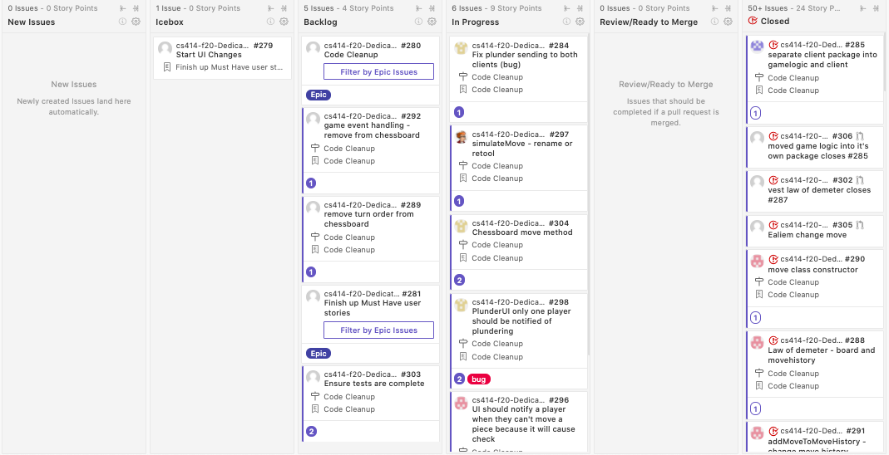
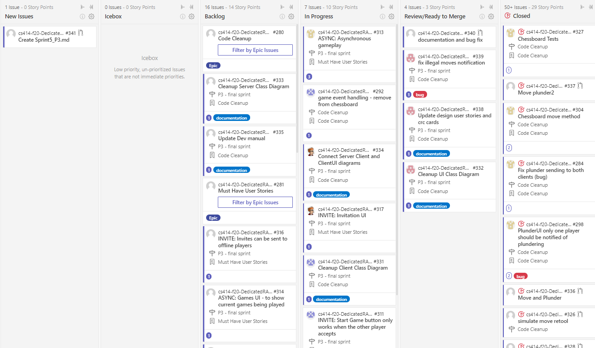
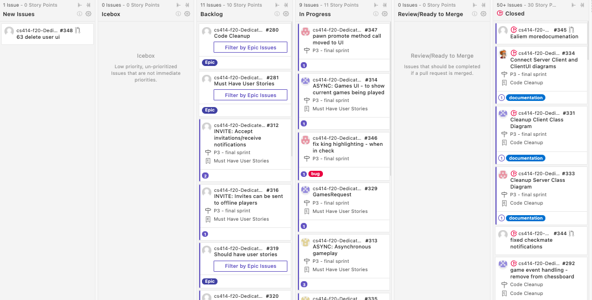
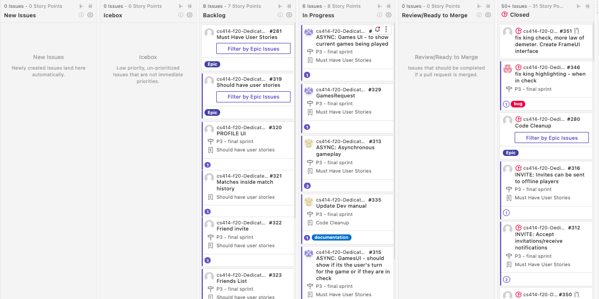

# Kanban Board
## Week 1 - 11/03

- Sprint planning
- Code review and refractoring

## Week 2 - 11/10

### Summary
- Code review and refractoring
- Check testing and coverage
- Updating design artifacts

## Week 3 - 11/17

### Summary
- Begin saving game state for asyncronous games
- Accepts invites from other players in UI
- Code cleanup and bug fixes
- Updating design artifacts

## Week 4 - 11/24 (Fall Break)

### Summary
- Worked on games and invite lists
- Worked on detele user feature

## Week 5 - 12/1 (Final Week)

### Summary
- Fix some bugs
- Complete asyncronous game play tasks
- Complete invite list and games list tasks
- Sprint Review on 04 December 2020
- Finishing up deliverables for P3 and presentation

## Additional Details
- [See Scrum ceremonies sprint 4](https://github.com/rwahlst/cs414-f20-DedicatedRAMs/blob/master/design/Sprints/Sprint4_P3.md)
- [See Scrum ceremonies sprint 5](https://github.com/rwahlst/cs414-f20-DedicatedRAMs/blob/master/design/Sprints/Sprint5_P3.md)
