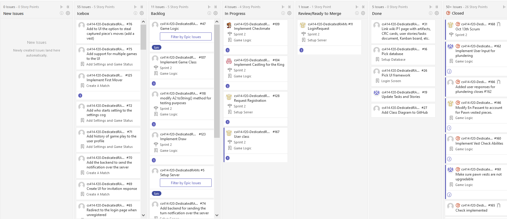

# Kanban Board
## Week 1
### Start of Week

### End of Week

### Summary
- Sprint Planning, added items to the board
- Chess logic
- Server/Client communication
- Setup database

## Week 2
### Start of Week

### End of Week

### Summary
- Working on setting up the UI
- Server configuration

## Week 3
### Start of Week

### End of Week

### Summary
- Finishing up deliverables for P2
- Working on presentation, powerpoint, and script
- Sprint Review on 16 October 2020 and ....

## Additional Details
- [See Scrum ceremonies output](https://github.com/rwahlst/cs414-f20-DedicatedRAMs/blob/master/design/Sprints/Sprint2_P2.md)
