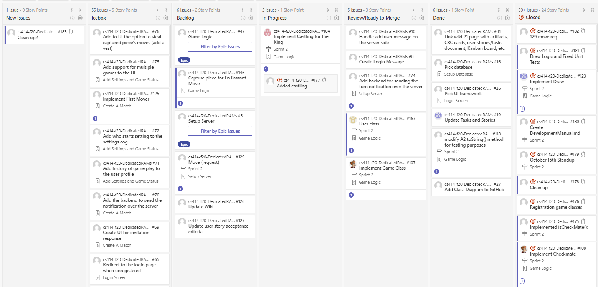

# Kanban Board
## Week 1
### Start of Week

### End of Week

### Summary
- Sprint Planning, added items to the board

## Week 2
### Start of Week

### End of Week

### Summary
- 

## Week 3
### Start of Week

### End of Week

### Summary
- Finishing up deliverables for P1
- Working on presentation, powerpoint, and script
- Sprint Review on 25 September 2020

## Additional Details
- [See Scrum ceremonies output](https://github.com/rwahlst/cs414-f20-DedicatedRAMs/blob/master/design/Sprints/Sprint2_P2.md)
