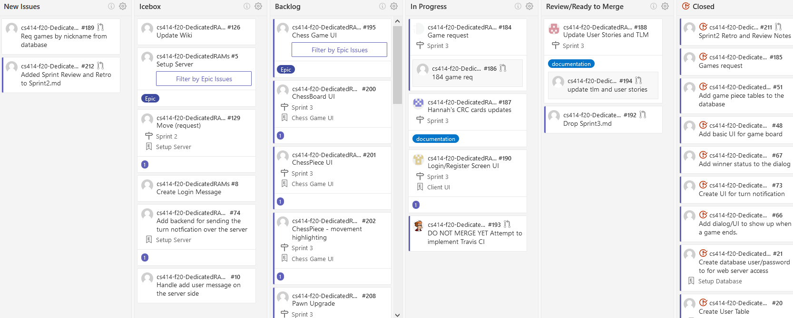

# Kanban Board
## Week 1
### Start of Week

### End of Week

### Summary
- Sprint planning
- Chess logic
- Server/client communication
- Setup database

## Week 2
### Start of Week

### End of Week

### Summary
- Sprint planning
- Finish up logic 
- Working on setting up the UI
- Database connection configuration

## Week 3
### Start of Week

### End of Week

### Summary
- Work on edge UI cases
- Fix some bugs
- Finishing up deliverables for P2 and presentation
- Sprint Review on 30 October 2020

## Additional Details
- [See Scrum ceremonies output](https://github.com/rwahlst/cs414-f20-DedicatedRAMs/blob/master/design/Sprints/Sprint2_P2.md)
